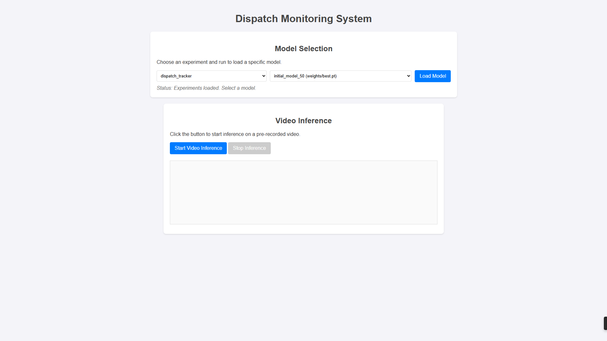
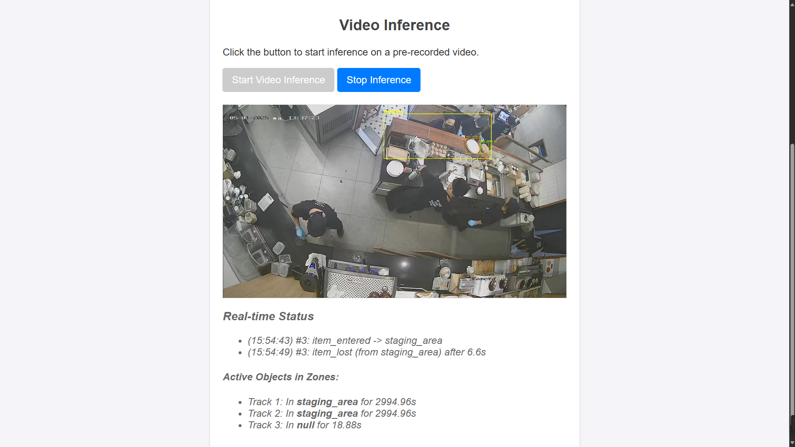

# Dispatch Monitoring System

```
PROBLEM SCOPE

Dispatch Monitoring System
- Develop an intelligent monitoring system for a commercial kitchen's dispatch area. 
- Using the provided video and dataset (in ./datasets/)
- build a complete solution capable of tracking items within the dispatch area. 
- The system should also include functionality to improve model performance based on user feedback

Requirements:
- Use *Docker Compose* for system deployment.
- Provide a *README* file with clear installation and usage instructions.
- Upload all source code and trained models to *GitHub.*
```

An intelligent monitoring system for a commercial kitchen's dispatch area, built with a modern MLOps stack. The system uses computer vision to track items, identify them, and classify their state. It features a web interface for live monitoring and model management, all orchestrated with Docker Compose.

## System Architecture

The system is composed of several services working together:

-   **Dispatch Monitor**: A FastAPI application that serves the web UI, handles video processing, and exposes an API for model management.
-   **MLflow Server**: For experiment tracking, model logging, and artifact storage. It's the central hub for our trained models.
-   **MinIO**: An S3-compatible object storage server used by MLflow to store model artifacts (like weights, code, and metrics).
-   **PostgreSQL**: The backend database used by MLflow to store experiment metadata.
-   **Two-Stage Model Pipeline**:
    1.  **Detector (YOLOv)**: A primary model that detects and tracks objects of interest (e.g., `dish`, `tray`) in the video feed.
    2.  **Classifier (ResNet)**: A secondary model that classifies the state of a detected object (e.g., a `dish` can be classified as `empty`, `not_empty`, or `kakigori`).

> Note: As I've already decouple the Detector and Classifier, it's simple in the future to "plug-and-play" other models/architectures.




## Directory Layout
```
eatlab-au-tracker/
├── config.env.example          # Example for environment variables
├── .gitignore
├── docker-compose.yml
├── mlflow.Dockerfile
├── README.md
├── requirements.txt
├── configs/                     
│   ├── dispatch_data.yaml      # Config for train Detector
│   └── settings.py             # TODO
├── scripts/                    # TODO (refactor)
│   ├── train_detector.py       # src/train.py
│   └── train_classifier.py     # src/scripts/train_resnet.py
├── src/                        # Main application source code
│   ├── __init__.py
│   ├── main.py                 # TODO: Main FastAPI app entrypoint
│   ├── api/                    # TODO: For API-related modules
│   │   ├── __init__.py
│   │   ├── endpoints.py        # Logic from your old api.py
│   │   └── schemas.py          # Pydantic models (e.g., FeedbackIn)
│   ├── models/                 # For model interaction logic
│   │   ├── __init__.py
│   │   ├── classifier.py       # Handles loading and running the classifier
│   │   └── detector.py         # Handles loading and running the YOLO detector
│   ├── services/               # external services
│   │   ├── __init__.py
│   │   ├── feedback.py         # TODO
│   │   └── mlflow_client.py    # Dedicated client for all MLflow interactions
│   └── track/                  # "track" related functionalities
│       ├── __init__.py
│       └── BaseTrack.py   
└── static/                     # UI
    ├── index.html
    ├── script.js
    └── style.css
```

## Prerequisites

-   Docker
-   Docker Compose

## 1. Setup & Configuration

1.  **Clone the Repository**:
    ```bash
    git clone <repository-url>
    cd eatlab-au
    ```

2.  **Set Up Environment Variables**:
    Create a `config.env` file by copying the example:
    ```bash
    cp config.env.example config.env
    ```
    The default values in `config.env.example` are configured to work together out-of-the-box. You do not need to change them to get started. **Note**: The file must use the `KEY=VALUE` format.

3.  **Place Datasets**:
    Ensure the `datasets` folder provided for the project is placed in the root of this repository. The training scripts and video stream source depend on it.

## 2. Running the System

Start all services using Docker Compose (The `--env-file` flag loads the variables you just configured).

```bash
docker compose --env-file config.env up -d --build
```

This will build the necessary Docker images and start all containers in the background.

Once running, you can access the different components of the system:

-   **Main Application**: `http://localhost:8000`
-   **MLflow UI**: `http://localhost:5000`
-   **MinIO Console**: `http://localhost:9001` (Use `minio_user` and `minio_pwd` to log in, as defined in your `config.env`).

### 2.1 Ultilize my submitted "interview_specific_scripts"

I've already included the trained data in the submission, but this System is highly integrated with MLFlow, you can't just put the weights into it and run. Instead, you can "restore" the data and model weights using the scripts that I've already included in `./interview_specific_scripts`.

After the system is successfully up, you can run this script:
```bash
sudo ./interview_specific_scripts/restore.sh
```

This script will extract the `minio_data.tar.gz` (as you guess, this is the data that I exported from my MinIO), and "move" it to the `./data`, which is set as the volume of `dispatch-monitor` in `docker-compose.yml`. Next, it remove the default `mlflow` database in Postgre Database and create new and import data to it (as it do with MinIO).

You can do the opposite (export your data from Postgre and MinIO) by using the other script:
```bash
./interview_specific_scripts/backup.sh
```

## 3. Training the Models

The system relies on two separate models. You must train them to make the system fully operational. Training runs are automatically logged and stored to the MLflow server.

To streamline the development process, training is managed via Docker Compose profiles. This isolates the training environment and prevents training from running automatically every time you start the application.

### 3.1. Training the Detector (YOLOv10)

This model detects objects like `dish` and `tray`.

To run the training process, use the `train-detector` profile:
```bash
docker compose --env-file config.env up --build --profile train-detector
```
This command builds the necessary image and starts a container to run the detector training script. The script logs the trained model, metrics, and artifacts to MLflow under the `dispatch_tracker` experiment.

After training, you must manually load the detector model via the web interface. Go to `http://localhost:8000`, select the experiment and run, and click "Load Model".

### 3.2. Training the Classifier (ResNet)

This model classifies the *contents* of a detected dish (e.g., `kakigori`).

To run the training, use the `train-classifier` profile:
```bash
docker compose --env-file config.env up --build --profile train-classifier
```
This will execute the script, which trains the ResNet model and logs it to MLflow under the `dispatch_classifier` experiment.

The system is designed to **automatically load the latest version of the classifier** from the `dispatch_classifier` experiment every time the `dispatch-monitor` container starts. After training, simply restart the main application services to use your new model:
```bash
docker compose --env-file config.env up -d
```

## 4. The User Interface (UI)

Just a simple UI. First, Go to `http://localhost:8000`, select the experiment and run, and click "Load Model" (you HAVE TO load model, or it will use the have-not-yet-finetuned YOLOv8 as default). On the other side, the Classifier will be automatically load with the latest run. NOTE: Sorry for the inconsistence design here, bear me if it makes you confuse at first.

After you load the Detector, you can click on "Start Video Inference", wait a bit, and there you go.

## 5. Future Plan for User Feedback

Unfortunately, the User Feedback functionality has not yet been functional in this current system. Some thoughts on how to integrate it in the future:

- First, I've planned for the `/feedback` API endpoint from the beginning. This currently captures detailed user corrections, including (1) frame numbers, (2) bounding boxes, and (3) correct labels. This data will be stored in the same `postgre` Database thta MLFlow use.

- To create train data from the user feedback, we can:
    -   Query the database for new feedback entries.
    -   Extract relevant video frames and crop bounding boxes.
    -   Organize this new data into training and validation sets compatible with the YOLO detector and ResNet classifier formats.

- With the data ready, we can write re-train script, the script could be triggered and run on command.

- Of course this re-train process will be track using MLFlow as with the initial train. From that, we will have all the information needed to compare/validate the models, and simply choose what best model to be use in the System (production).

##  6. Screenshots



